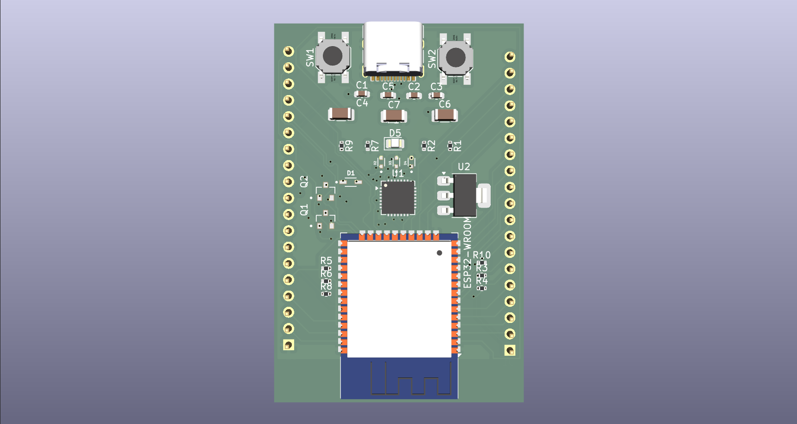

# TGC-Core-ULTRA32-v1

## Overview
The **TGC-Core-ULTRA32-v1** is an open-source, high-performance hardware development core board based on the **ESP32** platform. Engineered for wireless application prototyping and IoT deployment, [...]

This repository contains the complete set of KiCad EDA files (version 10.0) necessary to view, modify, or manufacture the printed circuit board (PCB).

---

## Key Hardware Features

* **Microcontroller Core:** Powered by an **ESP32-WROOM-32** module, featuring a dual-core 32-bit Xtensa LX6 processor running up to 240 MHz.
* **Wireless Capabilities:** Integrated **Wi-Fi** (802.11 b/g/n) and dual-mode **Bluetooth** (Classic & BLE) with an onboard PCB trace antenna.
* **Seamless Programming:** Features an onboard **CP2102N** USB-to-UART master bridge chip, enabling effortless code flashing and hardware debugging.
* **Modern Power & Data Interface:** Equipped with a physical **USB Type-C** connector wired for high-reliability USB 2.0 configuration.
* **Onboard Power Regulation:** An onboard **AMS1117-3.3** Low Dropout (LDO) linear regulator steps down 5V VBUS power to a stable 3.3V rail capable of driving up to 1A.
* **Prototyping Breakout:** System pins and GPIO extensions are cleanly routed out to a generic single-row 19-pin hardware header (`Conn_01x19`).
* **PCB Specifications:** A robust 4-layer FR4 signal stackup engineered for optimal routing paths, power decoupling, and signal integrity.

---

## Repository Structure

The project is entirely self-contained within the following native KiCad design files:

| File Name | Description |
| :--- | :--- |
| `TGC-Core-ULTRA32-v1.kicad_pro` | The main **KiCad Project file**. Open this file to initialize the system workspace. |
| `TGC-Core-ULTRA32-v1.kicad_sch` | The **Schematic file**. Outlines the logical connections between the ESP32, CP2102N bridge, and power stages. |
| `TGC-Core-ULTRA32-v1.kicad_pcb` | The **PCB Layout file**. Houses the physical 4-layer trace configurations, via sizing, and physical board outlines. |
| `image_3c0a04.png` | A visual reference render of the completed board layout. |

---

## Getting Started

### 1. Hardware Inspection and Design
To view or modify the hardware design layout:
1. Download and install [KiCad EDA](https://www.kicad.org/) (ensure you are using KiCad v10 or newer to parse the modern project syntax).
2. Open the `TGC-Core-ULTRA32-v1.kicad_pro` file.
3. Launch the Schematic Editor or PCB Layout Editor to inspect components, footprints, and the default 4-layer layout structure.

### 2. Programming Setup
Because this core board uses standard ESP32-WROOM-32 pinouts and a CP2102N UART controller, it functions natively inside the ESP32 firmware environment:
1. Install the [Arduino IDE](https://www.arduino.cc/en/software) or configure an environment in **VS Code / PlatformIO**.
2. Add the ESP32 board package URL to your environments manager if using the Arduino IDE.
3. Connect the hardware core via a standard USB-C cable.
4. Under **Tools > Board**, select **"ESP32 Dev Module"** (or generic ESP32 WROOM module).
5. Match the assigned serial port and deploy your firmware sketches normally.

---

## License

This hardware design and its accompanying documentation are licensed under the **GNU General Public License v3.0 (GPL-3.0-or-later)**.

Summary of your rights under GPLv3:
* You are free to use, study, share, and modify the material.
* If you distribute the work (or a derivative), you must license the whole work under GPLv3 as well (share-alike).
* You must provide source for distributed derivative works and include the GPLv3 license text and copyright notices.

For the full legal text, see the GNU licenses page: https://www.gnu.org/licenses/gpl-3.0.html

Note: To make the change complete, consider adding a `LICENSE` file containing the full GPLv3 text and an explicit copyright line (for example: "Copyright (c) 2026 ThatGuyCodes605"). I can add that file for you if you want.
